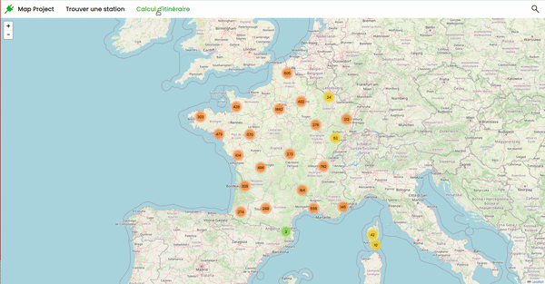
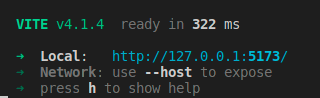
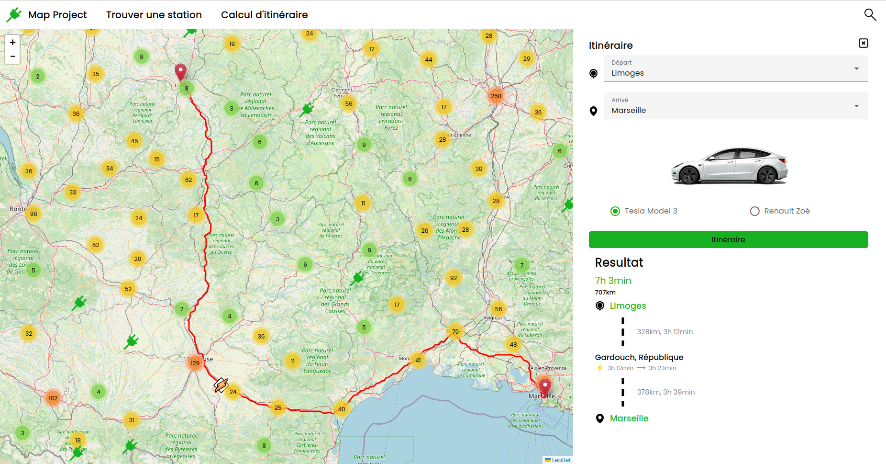
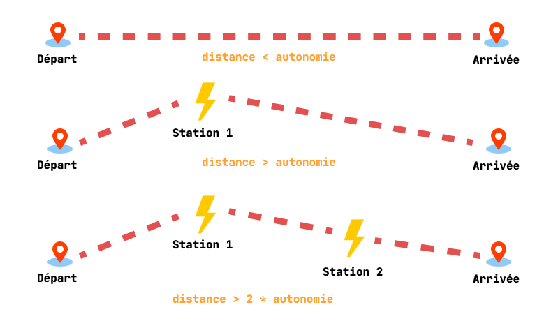
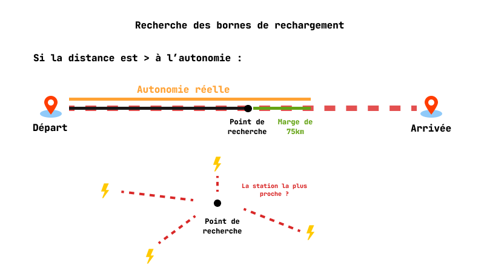

<!-- PROJECT LOGO -->
<br />
<div align="center">
  <a href="https://github.com/github_username/repo_name">
    
  </a>

<h1 align="center" style="font-weight:500">SmartEV</h1>

  <p align="center">
    Projet réalisé en cours de Technologies du web à CPE Lyon. Cette application web propose une recherche d'itinéraire pour véhicule électriques
    <br />
    <br />
  </p>
</div>


<!-- TABLE OF CONTENTS -->
<details>
  <summary>Table of Contents</summary>
  <ol>
    <li>
      <a href="#about-the-project">About The Project</a>
      <ul>
        <li><a href="#built-with">Built With</a></li>
      </ul>
    </li>
    <li>
      <a href="#getting-started">Getting Started</a>
      <ul>
        <li><a href="#prerequisites">Prerequisites</a></li>
        <li><a href="#installation">Installation</a></li>
      </ul>
    </li>
    <li><a href="#usage">Usage</a></li>
  </ol>
</details>


<!-- ABOUT THE PROJECT -->
## About The Project



SmartEV est un projet étudiant qui permet :
  * d'avoir une carte affichant l'emplacement des différentes infrastructures de charge, et permettant d'obtenir des informations sur celles-ci.
  * de réaliser un calcul d'itinéraire "intelligent" adapté aux véhicules électriques grace à une interface.
<p align="right">(<a href="#readme-top">back to top</a>)</p>


### Built With

* 
* 
* 
* 
* 


<p align="right">(<a href="#readme-top">back to top</a>)</p>


<!-- GETTING STARTED -->
# Getting Started


## Prérequis
Pour pouvoir lancer le projet SmartEV, l'outil **npm** doit être installé sur votre appareil.
### Pour installer **npm** :
* Sous **Linux**
  ```sh
  npm install npm@latest -g
  ```
* Sous **Windows**

    Télécharger via le lien suivant : [Node.js](https://nodejs.org/en/download "Node.js")

## Installation
Veuillez lancer un **cmd sous Windows** ou un **bash sous Linux** pour exécuter les commandes suivantes (1,2,3,4) :
1. Cloner le repo sur votre appareil

   ```sh
   git clone  https://github.com/cpe-lyon/groupe-1-chatelet-congiu-clere 
   ```
2. Déplacer vous dans le dossier contenent le projet

    ```sh
    cd map-project/
    ```
3. Installer les packages **npm**

   ```sh
   npm install
   ```
4. Puisqu'on utilise Mapbox et Openchargemap, vous aurez besoin d'utiliser un **token** pour chacune de ses API. Pour cela vous devrez créer un compte afin de l'obtenir.

5. Une fois les tokens récupérés, créer un fichier dans le dossier map-project nommé .env et écrivez les lignes suivantes en remplaçant les champs par vos tokens.

    ```sh
    VITE_TOKEN_MAPBOX=YOUR_TOKEN_MAPBOX
    VITE_TOKEN_OPENCHARGEMAP=YOUR_TOKEN_OPENCHARGEMAP
    ```
6. Lancer le projet

    ```sh
    npm run dev
    ```
7. Cliquer sur le lien qui s'affiche au niveau du champ local dans votre terminal pour accéder à la page web



<p align="right">(<a href="#readme-top">back to top</a>)</p>


<!-- USAGE EXAMPLES -->
## Utilisation

* Itinéraire entre 2 points comprenant le temps de recharge.



<p align="right">(<a href="#readme-top">back to top</a>)</p>

### Features

- Affichage d'une map interactive
- Affichage des bornes de recharges sur la carte
- Affichage des détails d'une borne (type, ville, adresse, prix)
- Itinéraire intelligent trouvant les bornes les plus proches sur le chemin selon les modèles de voitures (Tesla ou Zoé)
- Durée de l'itinéraire
- Détail de l'itinéraire
- Clustering des points de charge
- Trouver une station répertorié

<p align="right">(<a href="#readme-top">back to top</a>)</p>


### Algorithme

Dans ce projet, l'un des points majeurs a été d'implémenter l'algorith de récherche des stations de rechargement dans l'itinéraire.



Si la longueur de l'itinéraire est supérieur à l'autonomie de la voiture choisie, alors on détermine un point de recherche avec un marge (ici fixée à 75 km) puis on recherche la station la plus proche. Si le reste de l'itinéraire est toujours plus grand que l'autonomie alors on réitère l'operation jusqu'à obtenir un itinéraire possible




